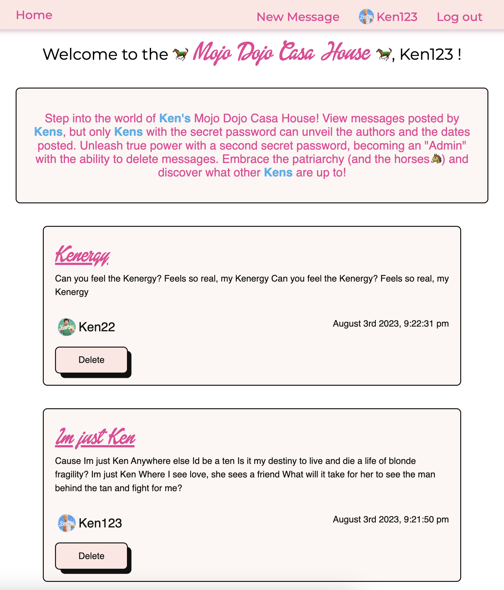
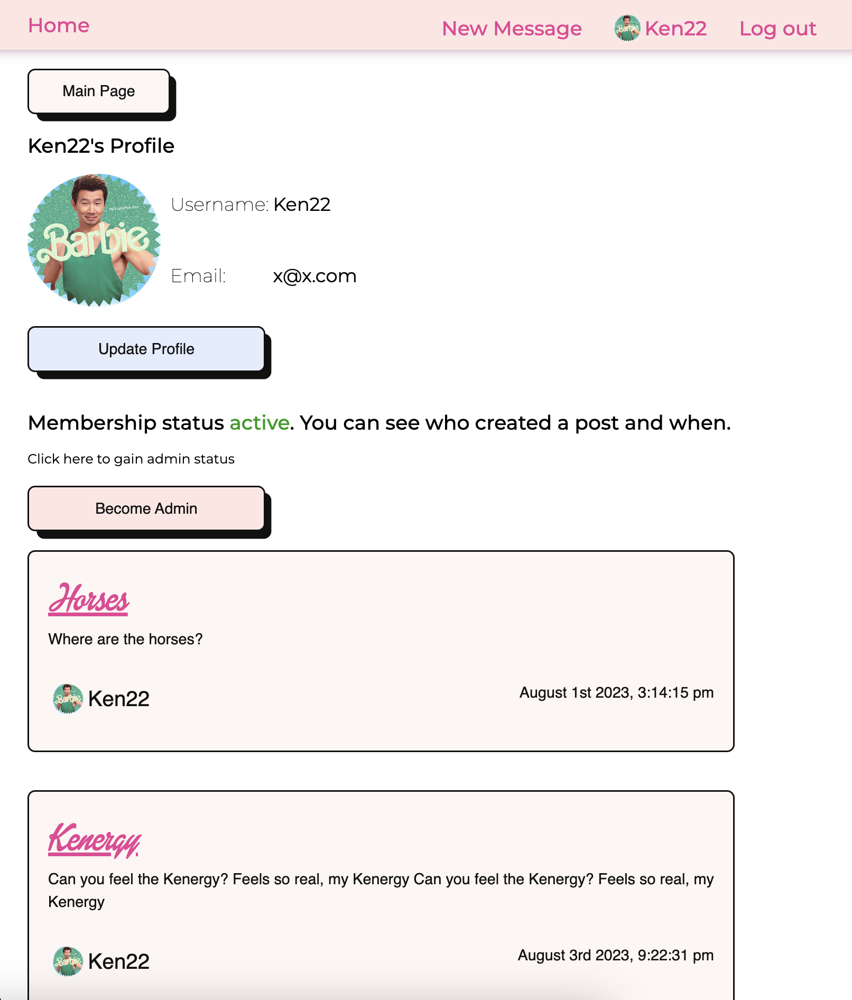
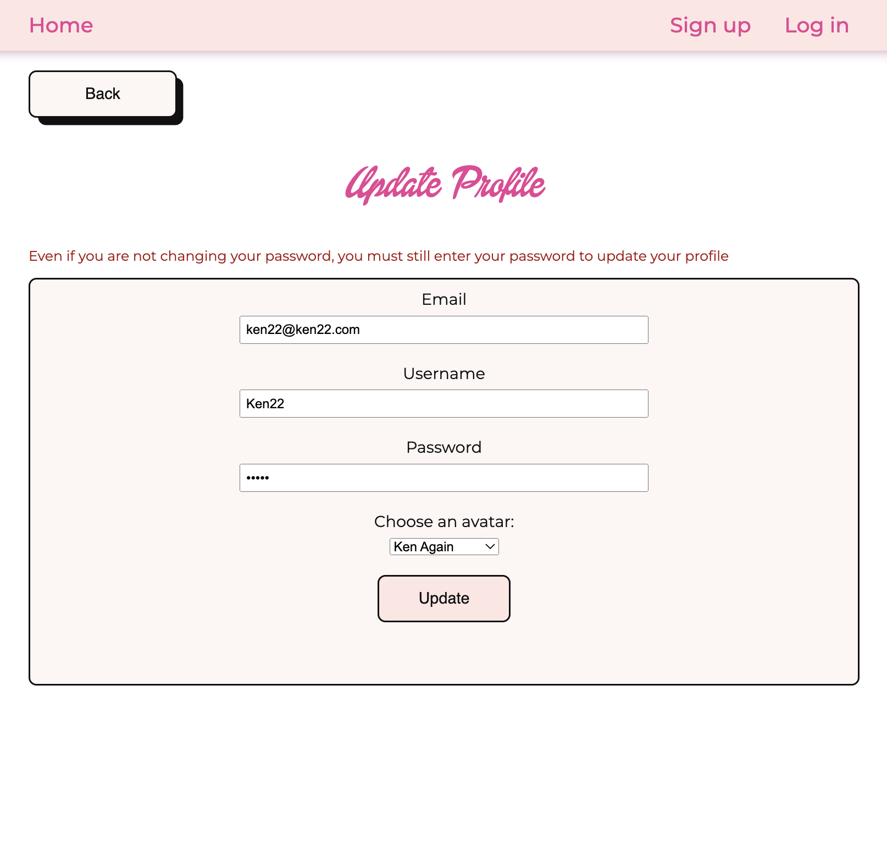
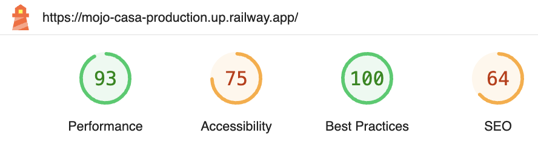

<h1>Mojo Dojo Casa Clubhouse</h1>

## Short Description
This website is a platform that allows users to create profiles and log in securely. Users can post messages and view messages created by others, and they have the option to update their profiles, including their username, email, password, and avatar image. Everyone can see the posts, but only those who know the secret password can see who posted and when. Those with admin access can also delete posts.

## Demo
Checkout the <a href='https://mojo-casa-production.up.railway.app/' target="_blank">live demo</a>. If you want to experience all the features the member password is "kenough" and the admin password is "barbierulez".

## Showcase

The images and the GIF illustrate how the page works. First, the user is taken to the homepage, where all the posts can be seen. The user can either sign-up or log into their account. Once the user is logged in, they have the options to post, update their account and become member or admin.

## Performance

I used Google Lighthouse to run over my application to check its performance, accessibility, use of best practives and SEO opitimization.

## Tech Stack
<ul>
<li>Node.js</li>
<li>Express</li>
<li>MongoDB</li>
<li>Mongoose</li>
<li>Passport</li>
<li>Git</li>
</ul>

## What I learned
<ul>
<li>Learned how to set up and configure a Node.js application using Express.js as the web framework.
Gained knowledge about user authentication and session management using Passport.js, enabling secure login and profile access. I also added a password-hashing function using bcrypt.</li>
<li>Utilized MongoDB as the database for storing user information, messages, and other data, and learned about Mongoose for managing database operations in Node.js.</li>
<li>Explored the usage of EJS (Embedded JavaScript) as the templating engine to dynamically render HTML pages with data from the server, allowing for a dynamic and interactive user interface.</li>
<li>Learned about server-side validation using packages like Express Validator to ensure that user input is sanitized and validated before processing.</li>

</ul>
